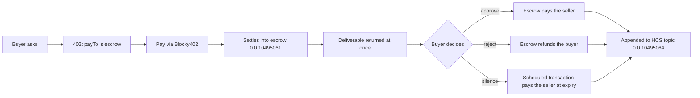

<p align="center">
  
</p>

<h1 align="center">Held</h1>

<p align="center">
  <strong>You pay first. The money waits until you have read what you bought.</strong>
</p>

Held is an x402-gated agent service on Hedera where the payment lands in escrow instead of the
seller's account. A buyer pays, receives the deliverable immediately, and then decides. Approve and
the seller is paid. Reject and the buyer is refunded. Say nothing and a Hedera scheduled transaction
pays the seller when the review window expires.

I built it around one question: **what has to be true before you hand money to an agent you have
never used?** x402 settles the instant a response is written, which is correct for a weather API and
backwards for work you have to read before you can judge it. Held changes one field to fix that.

[Open Held](https://heldprotocol.xyz) · [Watch the demo](https://youtu.be/E6pMtAp4fls) · [Verify it on Hedera](https://heldprotocol.xyz/proof) · [Read the 402](https://heldprotocol.xyz/build) · [What can go wrong](https://heldprotocol.xyz/invariants) · [Run it locally](#quick-start)

> **Project stage:** Hedera testnet only. No mainnet writes and no real funds. The escrow is a plain
> Hedera account, not a contract, which means the operator holds its key. That is stated here, in
> [`AI-USE.md`](AI-USE.md), and on the site, rather than left for a reader to discover.

Built for ETHOnline 2026, Hedera "AI & Agentic Payments".

## Demo

[Watch the demo on YouTube](https://youtu.be/E6pMtAp4fls) (2:08). It shows a real paid request
settling into escrow, the buyer approving it, and a second run where nobody clicks and Hedera's own
scheduled transaction pays the seller.

## Why Held

Paying an agent is not like paying an API. You cannot tell whether you got what you needed until
after you have read it, and by then x402 has already paid the seller.

- **Escrow by substitution, not by protocol change.** The 402 challenge is ordinary x402. Only
  `payTo` differs, so any client that already speaks x402 can buy without modification.
- **Immediate settlement, deferred release.** The money moves on chain at once, so the seller knows
  it is real, but it lands where neither party can take it unilaterally.
- **Silence resolves forward.** A card authorisation nobody captures expires backwards and the payer
  keeps the money. This expires forwards, so a buyer cannot trap a seller's funds by going quiet.
- **Evidence the service does not own.** Every state change is appended to a Hedera Consensus
  Service topic. The service writes the lines; the network orders and timestamps them.
- **The build is identified, not just the seller.** An agent's version id is a hash of its prompt
  template, its model, and its own source, because that is what a buyer is actually approving.

## How it works



## Verify it yourself in 60 seconds

No account, no key, nothing to install. Every expected value below came from running these commands
before this README was written.

```sh
# 1. Ask for the resource without paying. The 402 names an escrow account, not the seller.
curl -s -X POST https://heldprotocol.xyz/work \
  -H 'content-type: application/json' \
  -d '{"question":"what does this cost"}' | jq '.accepts[0], .extensions.held'
#   payTo     "0.0.10495061"      <- escrow
#   network   "hedera:testnet"
#   amount    "5000000"           (0.05 HBAR in tinybars)
#   feePayer  "0.0.7162784"       <- the seller's own account, a different account
#   releasePolicy "approve pays the seller, reject refunds you, silence pays the seller at the deadline"

# 2. Confirm that escrow account is real, and holds money, straight from Hedera.
curl -s https://testnet.mirrornode.hedera.com/api/v1/accounts/0.0.10495061 | jq .balance.balance
#   1849999999          (tinybars, read 2026-09-13; it moves as jobs settle)

# 3. Read the evidence topic. Nobody needs our permission for this.
curl -s "https://testnet.mirrornode.hedera.com/api/v1/topics/0.0.10495064/messages?limit=1&order=desc" \
  | jq -r '.messages[0].message' | base64 -d | jq
#   {"jobId":"...","type":"released","payload":{...},"at":"...","tier":"hcs","degraded":false}
```

The third command is the point. It reaches Hedera directly and returns the same records the service
shows, without the service being involved at all.

## Current status

| Surface | Where | What it is |
| --- | --- | --- |
| **Service** | [heldprotocol.xyz](https://heldprotocol.xyz) | Seven pages: the argument, the buy flow, the register, per-job pages, live proof, the x402 reference, the invariants |
| **Health** | [`/health`](https://heldprotocol.xyz/health) | Which tier each subsystem is on and whether any is degraded |
| **Escrow account** | [`0.0.10495061`](https://hashscan.io/testnet/account/0.0.10495061) | The account `payTo` names |
| **Evidence topic** | [`0.0.10495064`](https://hashscan.io/testnet/topic/0.0.10495064) | Append-only record of every state change |
| **A deadline schedule** | [`0.0.10495601`](https://hashscan.io/testnet/schedule/0.0.10495601) | One armed auto-release |
| **Escrow contract** | [`0x75f1Eb37…6ebB0`](https://hashscan.io/testnet/contract/0x75f1Eb3700aECc1429c8e99Ed124Af7E3Ec6ebB0) | Release enforced by code, with a permissionless deadline |

### What the runs have shown

- All three endings executed on Hedera testnet with transaction ids anyone can resolve: approve,
  reject, and the deadline path. They are listed in [`evidence/PROOF.md`](evidence/PROOF.md).
- The deadline path was exercised without anyone touching it. Transaction
  `0.0.10491999-1789311316-678160340` was executed by Hedera's scheduled transaction, not by this
  service. The service only observed the result.
- The consensus topic held **219 messages** when this was written. It spans every run of the service
  including development machines, which is why it holds more jobs than any single deployment's own
  register.
- **13 of 13** tests pass, covering all three endings, the evidence trail, and an injected
  schedule-arming failure. `scripts/attack.js` fires five concurrent approvals at one job and
  exactly one is accepted.
- **All four contract endings executed on Hedera's EVM**, including a partial split (1.25 to the
  seller, 0.75 back to the buyer) and an expiry pushed by an account that was neither the buyer, nor
  the seller, nor this service. The contract held **0.0 HBAR** afterwards, so nothing was stranded.
  **21 of 21** contract tests pass, including a re-entrant seller that is paid exactly once and a
  256-run fuzz proving a split always conserves the amount. See [`evidence/CONTRACT.md`](evidence/CONTRACT.md).
- Two invariants were **broken and fixed during the build**, both visible on chain. Both are written
  up with their causes in [`evidence/INVARIANTS.md`](evidence/INVARIANTS.md) rather than quietly
  repaired.

These are single runs on a testnet, recorded because they happened. They do not establish uptime, an
SLA, throughput, or behaviour under load, and none of that is claimed.

### Limitations, and what I did not claim

- **Testnet only.** No mainnet writes, no real funds.
- **The live default is still the account escrow, not the contract.** The contract exists, is
  deployed, and every ending is proven on it (below), but the running service settles through the
  Hedera account because that is what the recorded demo shows. Switching the default is a
  deployment decision, not more building.
- **The job register is per-deployment.** It lives on a mounted volume and starts empty when a new
  deployment does. The consensus topic is the durable record; the register is a convenience.
- **`DEMO_BUY` spends the server's own funded account** so a visitor can try the flow without a
  wallet. It is rate limited and input capped, and it can be switched off, but a determined visitor
  can still drain that account. On testnet the fix is a refill.
- **Per-job pricing and partial release are off by default.** Both are built. `PRICING=perjob`
  makes the 402 quote scale with the question and caps it; the contract's `settle` splits a job
  between seller and buyer. The defaults stay flat and all-or-nothing so the recorded demo remains
  accurate.
- **A contract job id can be squatted.** `fund` takes the job id from its caller, so anyone can
  occupy an id with 1 tinybar and make the real buyer's call revert. Nothing is stolen and no held
  job is touched; the buyer retries under a new id. Keying jobs by caller and id would remove it,
  and that is the change to make before this runs anywhere that matters. Found by reviewing the
  deployed source, written up in `evidence/CONTRACT.md`.
- **The worker falls back.** If the model provider fails, output is produced by a deterministic
  stand-in, and every deliverable carries a byline naming which tier answered.

## Quick start

Requires Node 20. A Hedera testnet account is needed only for the live tier; without keys the
service runs on a local stand-in and says so on every page and receipt.

```sh
npm install
npm test          # 13 tests, no network, no keys
npm run seller    # http://localhost:4021
```

`npm test` runs the Hedera transaction dry-run, key handling, worker fallback, and the regression
suite. It builds every Hedera transaction offline and submits none of them.

To run against real Hedera testnet, copy `.env.example` and fill it in, then:

```sh
npm run go-live   # creates the escrow account, topic, and a funded buyer
npm run seller
npm run buyer ask "When does a Hedera scheduled transaction execute?"
npm run prove           # replays all three endings and rewrites evidence/PROOF.md
npm run test:contract   # 21 contract tests, local, no network
npm run prove:contract  # deploys to Hedera testnet and runs all four endings on chain
```

## Repository layout

```text
src/                  the service
  seller.js           x402 resource server, the 402 challenge, approve and reject
  settlement.js       Hedera transfers, escrow release, the scheduled transaction
  evidence.js         appends to the consensus topic, reads it back
  store.js            job state machine; transition() is the double-payout guard
  worker.js           the agent, with a tiered provider cascade
public/               the site: seven pages, one stylesheet, one script, no build step
contracts/
  src/HeldEscrow.sol  escrow enforced by code: per-job amounts, partial release, permissionless expiry
  test/               21 tests including re-entrancy and a conservation fuzz
scripts/              go-live, prove-live, prove-contract, the attack and regression suites
evidence/
  PROOF.md            transaction ids for all three endings, resolvable on HashScan
  CONTRACT.md         the deployed escrow contract and its four on-chain endings
  INVARIANTS.md       13 properties, how each is enforced and tested, and the two that broke
docs/                 architecture, deployment, access, and the demo script
spec/                 the plan, build log, and design record written as it happened
video/                the demo: Remotion composition, filming scripts, marker files
brand/                the mark, its art direction, and the rejected candidates
```

## How I approach the build

- Make the claim no stronger than the evidence, and write the evidence down first.
- A failure that was found is worth more written up than quietly fixed.
- Never present a degraded tier as a full one. Every output says which tier produced it.
- Put the proof somewhere the service does not control, so it survives the service being wrong.
- Probe an unfamiliar API and record the measurement with its date, rather than writing a call from
  memory.

## AI use

Claude Code wrote most of the code here and I directed it.
[`AI-USE.md`](AI-USE.md) names each intervention and what changed as a result, and the decisions are
recorded in [`spec/`](spec/) as they happened rather than asserted afterwards.

## Licence

MIT. See [`LICENSE`](LICENSE).
